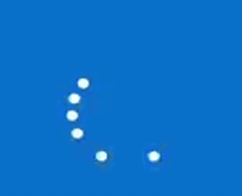

# AniMINT: UI Animation Interpretation Dataset

[](https://huggingface.co/datasets/pubacc/AniMINT)
[](https://arxiv.org/abs/2604.26148)
[](https://creativecommons.org/licenses/by-nc-nd/4.0/)

AniMINT is a dataset for evaluating whether vision language models (VLMs) can understand **UI animations** beyond static screenshots.

Modern user interfaces use animations to communicate feedback, state changes, progress, warnings, affordances, and other interaction-relevant information. AniMINT provides a dataset for studying how well multimodal models perceive, categorize, and interpret these dynamic UI signals.

 &nbsp;&nbsp;&nbsp;  &nbsp;&nbsp;&nbsp;  &nbsp;&nbsp;&nbsp; 

The dataset is hosted on Hugging Face:

**Dataset:** https://huggingface.co/datasets/pubacc/AniMINT  
**Paper:** https://arxiv.org/abs/2604.26148

**Citation:**
```bibtex
@misc{liang2026beyondscreenshots,
  title         = {Beyond Screenshots: Evaluating VLMs' Understanding of UI Animations},
  author        = {Liang, Chen and Jiang, Xirui and Deng, Naihao and Adar, Eytan and Guo, Anhong},
  year          = {2026},
  eprint        = {2604.26148},
  archivePrefix = {arXiv},
  primaryClass  = {cs.HC},
  url           = {https://arxiv.org/abs/2604.26148}
}
```
## Dataset Access

The full dataset is available on Hugging Face:

```python
from datasets import load_dataset

dataset = load_dataset("pubacc/AniMINT")
```

Dataset page: https://huggingface.co/datasets/pubacc/AniMINT


## Dataset Overview

AniMINT contains **300 densely annotated UI animation videos** collected from mobile, web, and desktop interfaces.

Each video is annotated with:

- start and end frame of the animation;
- animation region of interest(s);
- UI context;
- user input or triggering action, when applicable;
- 10 unique human-annotated, open-ended descriptions of the animation effect;
- 10 unique human-annotated, open-ended descriptions of the animation meaning;
- categorization of animation purpose.

| Property | Value |
|---|---|
| Dataset name | AniMINT |
| Full name | UI AniMation INTerpretation Dataset |
| Number of videos | 300 |
| Modality | UI animation video + text annotations |
| Platforms | Mobile, web, desktop |
| Platform distribution | Mobile: 75.00%; Web: 15.67%; Desktop: 9.33% |
| Median animation duration | 3.59 seconds |
| Annotation language | English |
| License | CC BY-NC-ND 4.0 |

Example schema:

```json
{
  "video_path": "000062_000000.mp4",
  "context_summary": "The user is switching the interface from light mode to dark mode.",
  "purpose_category": "Transition",
  "ROI": [
    {
      "box": [
        0.32597623089983024,
        0.32065217391304346,
        0.6646859083191851,
        0.6648550724637681
      ]
    }
  ],
  "Inputs": [
    {
      "modality": [
        "Mouse"
      ],
      "modality_extra": "",
      "type": [
        "Click/Tap"
      ],
      "type_extra": "",
      "textual_summary": "The user clicked the Switch button."
    }
  ],
  "animation_start_frame": 0,
  "animation_end_frame": 82,
  "effects_human_responses": [
    "It's a disc of sorts that moves from left to right.  It has stars in the background inside an pill shaped \"button\" of sorts.  ",
    "The yellow sphere turned into a gray moon and rotated towards the right.",
    "a circle in a green box changes colors as it moves",
    "A switch, initially in the left position, looks like a sun / daytime / bright, and as it rolls right, it turns into the moon/nighttime/dark.",
    "The animation goes from sun and clouds to moon and stars as it changes from light to dark mode.",
    "The sun transforms into a moon and rolls across the scroll bar in the fashion of a wheel and the daytime sky turns into a star filled night sky.",
    "the animation is showing the user that it triggered dark mode by switching the sun to a moon",
    "This is a toggle radio button that, and on the left, it resembles the sun that the image is bright. When the button scrolls to the right, the button turns grays with holes, resembling the moon, and the image becomes dark as night.",
    "The sun changes to a moon as it rolls right like a switch was flipped, and it goes to a darker screen as it enters dark mode",
    "The visuals on the interface switch went from a sunny daytime scene to a starry night scene. The colors got darker to symbolize that the mode was switching from light to dark. The button itself also moved from left to right."
  ],
  "meaning_human_responses": [
    "To me it conveys switching between daytime and nighttime mode, perhaps for screen brightness or other color scheme settings.",
    "The animation is conveying the transition from light mode into dark mode.",
    "The purpose of this animation to me is to possibly \"unlock\" something from moving it left to right.  This would allow access to an app or into a phone. ",
    "From light to dark or from day to night",
    "as the circle moves the content loads",
    "That the user has switched from light mode to dark mode or to grab the users attention.",
    "the purpose of this animation is to show the user that it triggered dark mode",
    "This is an app, possibly from a smartphone, related to the weather or time. It's advising the user in which mode the app is on.When the app is bright, it is in day mode, then at night, the app is in night mode.",
    "to highlight the fact that dark mode has been turned on and the icons and background will be darker",
    "The application is meant to turn on dark mode instead of light mode. The colors and theme get darker and the changing graphics represent that. To turn on dark mode, the user clicks the button and the nighttime scene comes up. To go back to light mode, they click the button again and the sunny daytime scene appears instead."
  ]
}
```


## Annotation Types

### Animation Purpose Labels

Each animation is assigned one expert-labeled purpose category.

AniMINT uses seven purpose categories:

| Label | Description |
|---|---|
| `Transition` | Supports a layout, screen, or state change in the interface. |
| `Demonstration` | Reveals or explains the behavior, functionality, or structure of an interface element. |
| `Guidance` | Guides the user toward an intended interaction. |
| `Feedback` | Provides a visual response to user input or system action. |
| `Visualization` | Represents system status, data, progress, or other information. |
| `Highlight` | Draws attention to specific content or an interface element. |
| `Aesthetic` | Enhances visual appeal or emotional experience without primarily conveying required information. |

Purpose label distribution:

| Purpose | Count | Percentage |
|---|---:|---:|
| `Visualization` | 114 | 38.00% |
| `Transition` | 45 | 15.00% |
| `Feedback` | 40 | 13.33% |
| `Highlight` | 39 | 13.00% |
| `Guidance` | 26 | 8.67% |
| `Demonstration` | 20 | 6.67% |
| `Aesthetic` | 16 | 5.33% |

### Animation Effect Descriptions

Each video includes **10 unique human-written open-ended descriptions of the animation effect**.

These annotations describe what visually happens in the animation, such as an element shaking, a progress ring filling, an icon bouncing, a button fading, or a panel sliding. They focus on the perceptual and motion-level properties of the animation.

### Animation Meaning Descriptions

Each video includes **10 unique human-written open-ended descriptions of the animation’s meaning**.

These annotations describe what the animation communicates in context, such as an error, progress, confirmation, warning, loading state, guidance cue, or system response. Because UI animation interpretation can be subjective, AniMINT preserves multiple independent human annotations instead of reducing each video to a single reference answer.


## Intended Use and DMCA Notices

AniMINT is released for **non-commercial research and evaluation purposes**. The dataset may include recordings of third-party user interfaces, logos, or other UI assets. The research team has cut the video to primarily focus on the research evaluation purposes. The collection source for each animation is attributed in the [datasource.csv](https://huggingface.co/datasets/pubacc/AniMINT/blob/main/datasource.csv). All third-party rights remain with their respective owners.

If you are a rights holder, platform operator, developer, or individual who believes that a dataset item should be removed or reviewed, please contact us at researchpubacc at gmail.com with details including the dataset item ID or filename, the reason for the request, your relationship to the content or rights holder, and a contact method for follow-up.


## License

AniMINT is released under the **Creative Commons Attribution-NonCommercial-NoDerivatives 4.0 International License**.

License: https://creativecommons.org/licenses/by-nc-nd/4.0/

Under this license, users may share the dataset with attribution for non-commercial purposes, but may not distribute modified versions of the dataset.

The dataset may include screenshots or recordings of third-party user interfaces. All third-party trademarks, logos, product names, software, and interface designs remain the property of their respective owners.

The dataset license applies to the dataset curation, metadata, and annotations to the extent licensable by the dataset authors. It does not grant rights to third-party trademarks, logos, software, or copyrighted UI assets beyond what may be allowed by applicable law.
